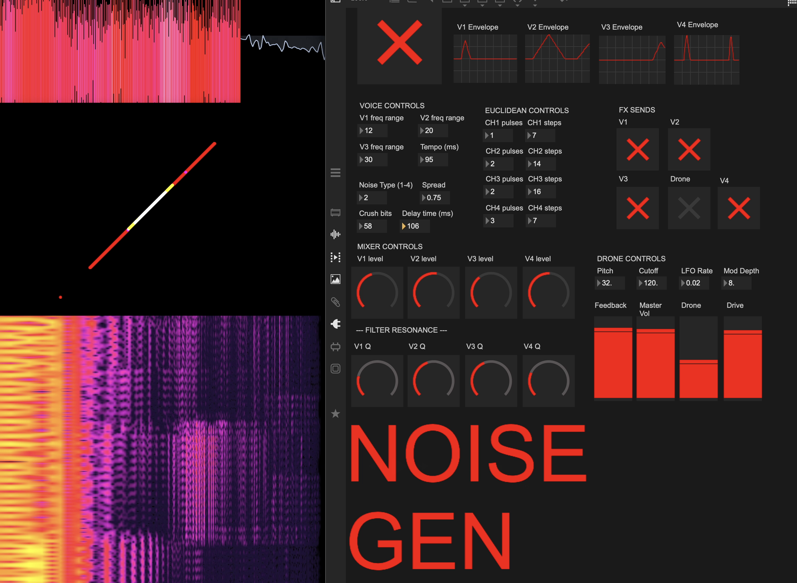
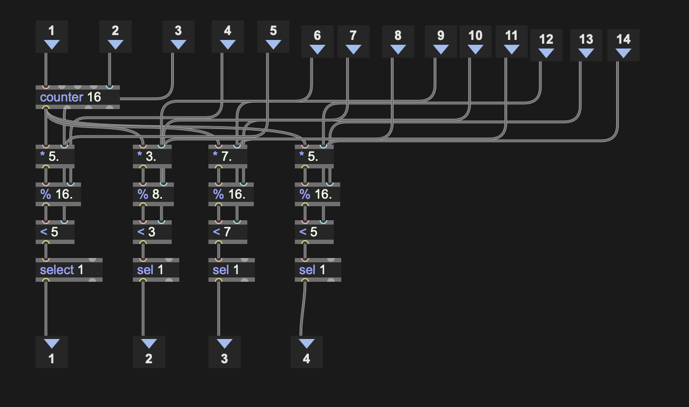
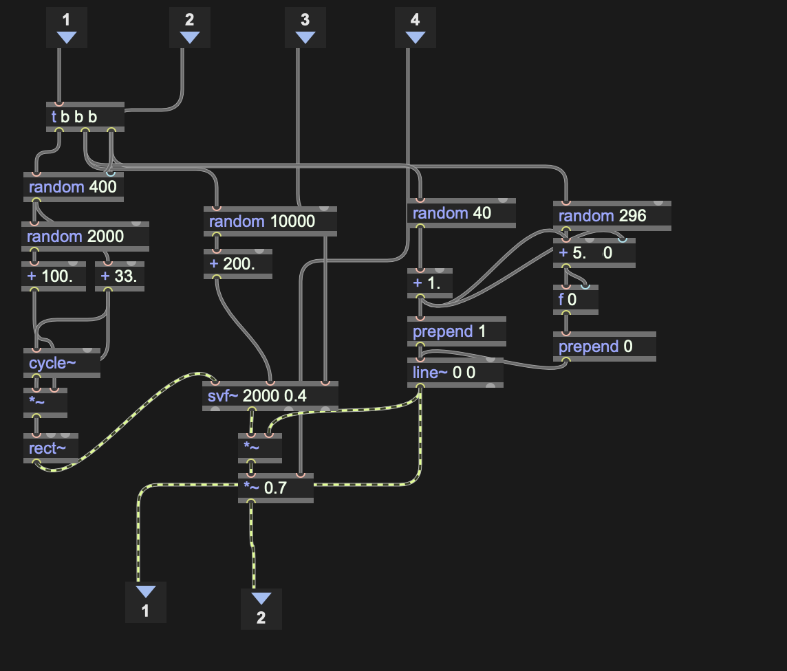
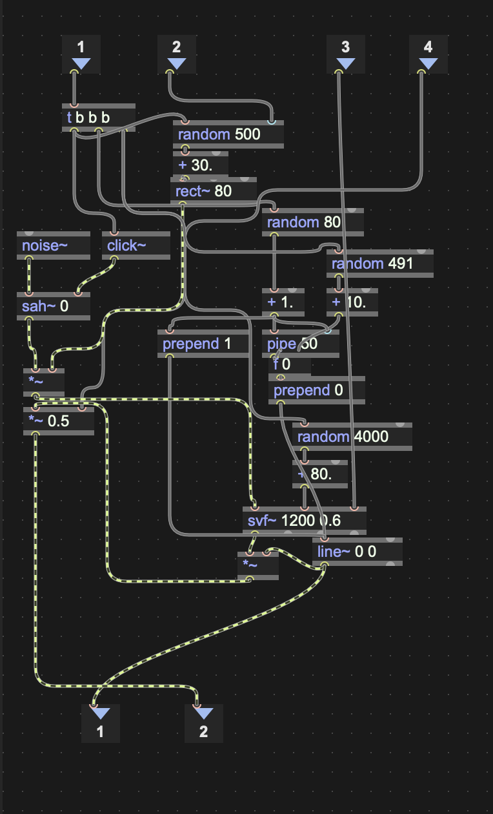
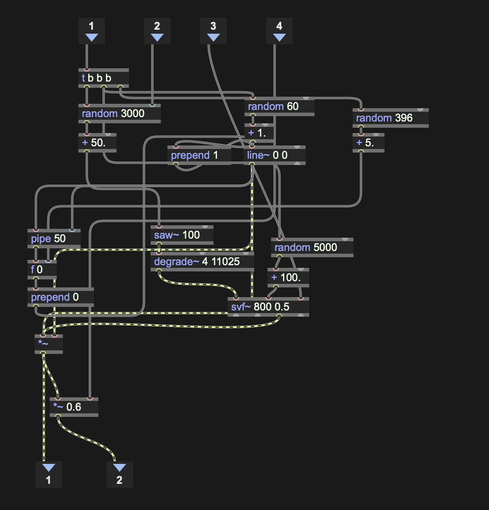
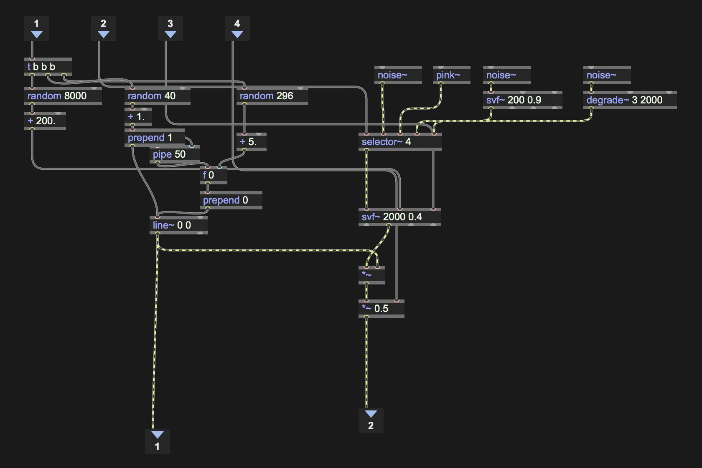
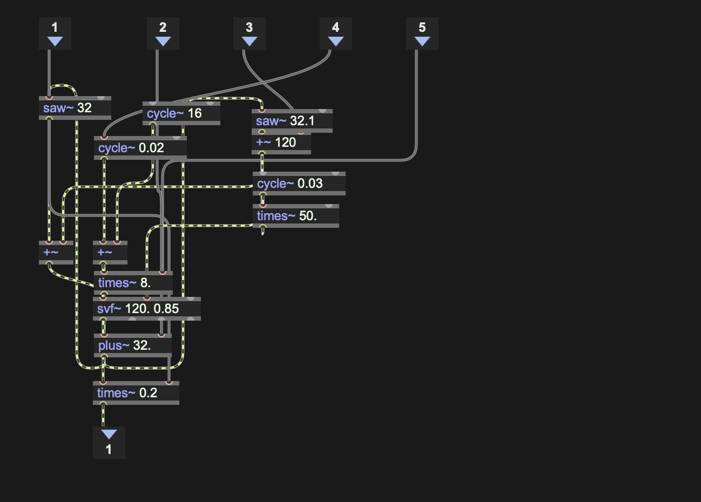
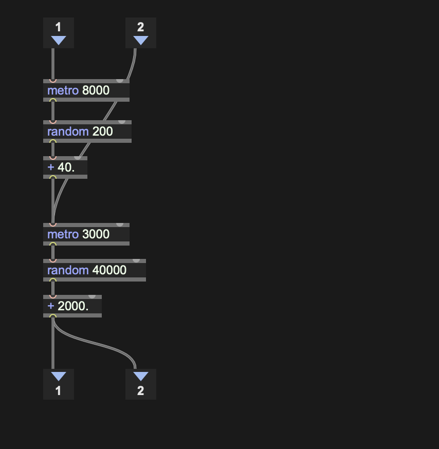
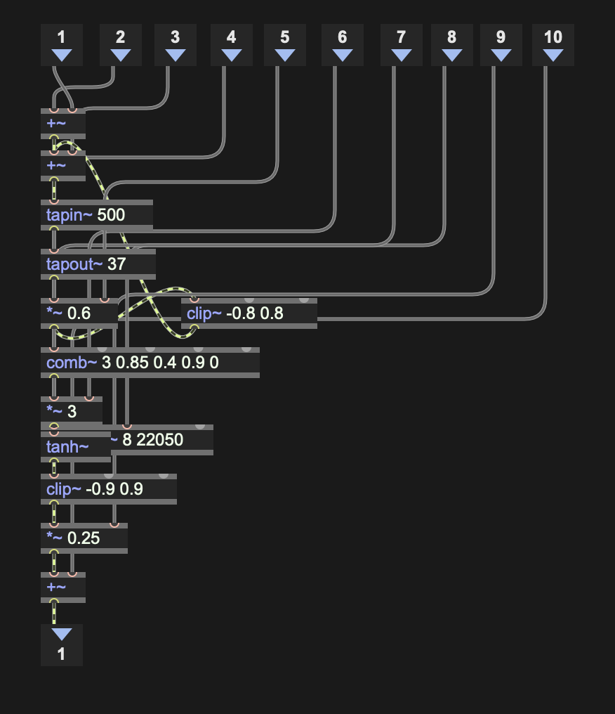
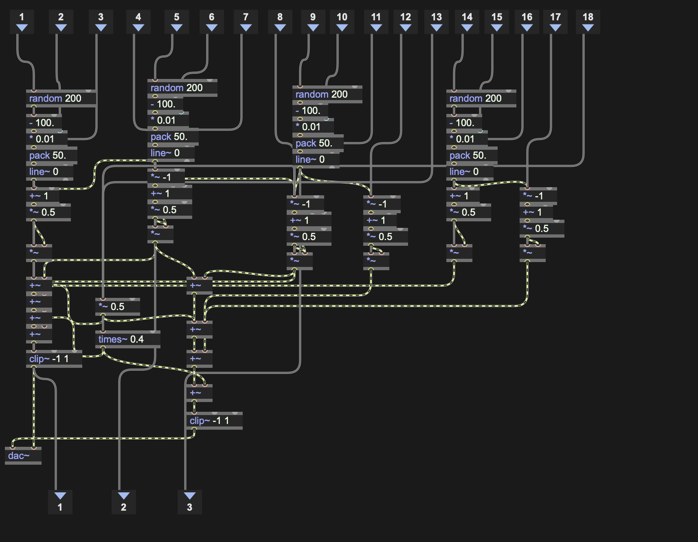

# MAX Archive

In this repository, I'll be revisiting and restoring patches that I've been programming since 2003. Some of them were originally created in Pure Data and are now being rebuilt in Max to keep them functional and accessible.

These are primarily tools for sound generation, visuals, and control systems that have accompanied my productions over the years. Together, they form a personal archive of instruments, experiments, and working methods that have shaped projects across different periods of my practice.

I'll be gradually making them available here, preserving not only the tools themselves but also some of the ideas, processes, and obsessions that led to their creation.

---

# Noisetool

A generative noise instrument built in Max/MSP. Four rhythmically triggered voices and a continuous drone feed into a shared effects chain and stereo panning system, producing evolving textural soundscapes.



## Architecture

```
Metro --> Euclidean Sequencer (4 channels)
            |        |        |        |
          Voice1   Voice2   Voice3   Voice4
            |        |        |        |
            +--------+--------+--------+--> Stereo Panning --> dac~
            |        |        |        |
            +--[FX gates]--+-----------+--> Effects Chain --^
                                                |
          Drone --------------------------------+--> Panning
```

The master metro drives a 4-channel Euclidean sequencer. Each channel fires rhythmic triggers into its voice. Every voice produces a short, enveloped burst with randomized parameters on each trigger. The drone runs continuously underneath. All audio passes through a stereo panning module with per-voice random positioning, and optionally through a shared effects chain controlled by per-voice FX send toggles.

## Modules

### Euclidean Sequencer



A 4-channel Bjorklund/Euclidean rhythm generator. A single `counter` drives all channels. Each channel has independent **pulses** and **steps** parameters that determine its rhythmic pattern through a `* -> % -> < -> sel 1` chain. Outputs a bang per channel when the pattern activates.

### Voice 1 -- Ikeda Oscillator



Randomized `cycle~` and `rect~` oscillators through an `svf~` bandpass filter. Each trigger randomizes frequency, modulation index, filter cutoff, and envelope shape (attack/decay via `line~ 0 0`). Produces sharp, clicky tonal bursts inspired by Ryoji Ikeda's micro-sound aesthetics.

### Voice 2 -- Noise Ring



`noise~` sampled by `sah~` (sample-and-hold) with a `click~` trigger, creating stepped random waveforms. Filtered through `svf~` with randomized cutoff and envelope. The `rect~` frequency is randomized per trigger for varying timbral density. Produces metallic, ring-modulated textures.

### Voice 3 -- Bitcrush



`saw~` through `degrade~` (bit-crushing and sample-rate reduction) into `svf~` filtering. Randomized frequency, filter cutoff, and envelope per trigger. Produces gritty, lo-fi digital artifacts with a raw, aggressive character.

### Voice 4 -- Noise Generator



Four switchable noise types routed through `selector~ 4`:

| Type | Source | Character |
|------|--------|-----------|
| 1 | `noise~` | White noise -- full spectrum |
| 2 | `pink~` | Pink noise -- 1/f, warmer |
| 3 | `noise~` through `svf~ 200 0.9` LP | Brown noise -- deep rumble |
| 4 | `noise~` through `degrade~ 3 2000` | Crackle -- digital artifacts |

Selected noise passes through `svf~` bandpass with randomized cutoff per trigger, shaped by the same attack/decay envelope as voices 1-3.

### Drone Oscillator



Continuous tone generator using detuned `saw~` oscillators (32 Hz and 32.1 Hz) with slow `cycle~` LFO modulation, summed and filtered through `svf~` lowpass at 120 Hz. Produces a deep, slowly evolving bass foundation.

### Drone Modulation



Slow random parameter modulation for the drone. Two independent `metro` clocks (8s and 3s) drive `random` values that periodically shift the drone's pitch and filter cutoff, keeping the drone texture alive over long durations.

### Effects Chain



Shared effects processor fed by per-voice FX send gates (`*~` controlled by toggles). Signal path: `tapin~/tapout~` delay into `comb~` resonator with feedback (`*~ 0.6` loop), through `tanh~` soft saturation and `clip~` limiting, scaled by `*~ 0.25` for return level. Creates dense, reverberant feedback textures.

### Stereo Panning



4-channel stereo panning with per-voice random pan positioning. On each Euclidean trigger, a new random pan position is generated, scaled by a global **Spread** parameter, and smoothed with `line~`. Equal-power panning coefficients (`+~ 1 -> *~ 0.5` for R, `*~ -1 -> +~ 1 -> *~ 0.5` for L) multiply each voice's audio. All channels sum through a cascade of `+~` bus objects into `clip~ -1 1` limiting before `dac~`. The drone enters at center (mono `*~ 0.5` to both channels). The effects return is scaled by `times~ 0.4` before the final mix.

## Controls

| Control | Range | Description |
|---------|-------|-------------|
| Tempo (ms) | 50-500 | Master metro interval |
| CH1-4 pulses | 1-16 | Euclidean hits per cycle |
| CH1-4 steps | 1-16 | Euclidean cycle length |
| V1-V3 freq range | 1-1000 | Oscillator frequency range |
| Noise Type | 1-4 | V4 noise source (white/pink/brown/crackle) |
| V1-V4 level | 0.0-1.0 | Per-voice output volume |
| V1-V4 Q | 0.0-1.0 | Per-voice filter resonance |
| FX Sends | on/off | Per-voice toggles for effects routing |
| Spread | 0.0-1.0 | Stereo pan width |
| Crush bits | 1-16 | Bitcrusher bit depth |
| Delay time (ms) | 1-500 | Effects delay time |
| Drone Pitch | Hz | Drone base frequency |
| Drone Cutoff | Hz | Drone filter cutoff |
| LFO Rate | Hz | Drone modulation speed |
| Mod Depth | 0-100 | Drone modulation amount |
| Feedback / Master Vol / Drone / Drive | 0.0-1.0 | Mixer levels |

## Requirements

- Max 9 (uses `pink~`, `degrade~`, `svf~`)
